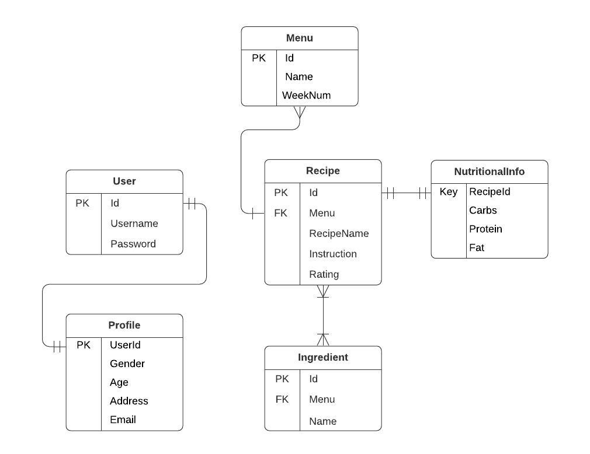

Overview


## Design
Beego, a RESTful web framework is used in the building of this API following the Model-View-Controller (MVC) Architecture. Beego supports Swagger for automated documentation generation of the API.

REST APIs were created for User, Menu, Recipe, and Ingredient data models with CRUD-like function (Create, Read, Update, and Delete). APIs for each data model contains a controller, model, and an endpoint in router.

### Project Structure

```
-conf
-controllers
-main.go
-models
-routers
-swagger
-tests
```

Routers is where the endpoints are specified, Controllers is where the brain of the API is developed, and models are used for the data handling required by the controller, while the conf is the configration fle to store credentials for the database and other information about API. 

E2E test is conducted using Postman and documentation is auto generated using swagger.


## Diagram
This is the intended data model schema, detailing entity attributes and relationship.



